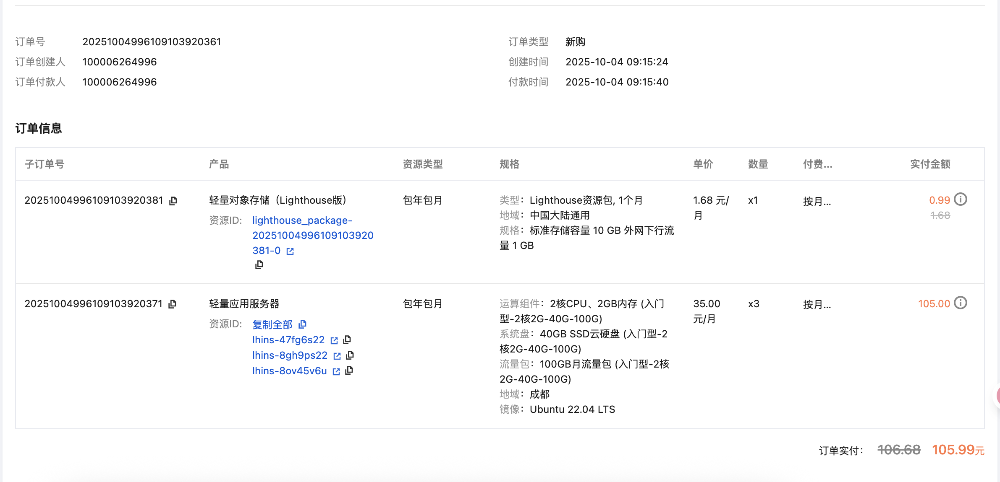

# K8S学习笔记

## 一，购买服务器

对比了腾讯云，阿里云，百度云。腾讯云价格更便宜，选择了腾讯云


## 二，安装K8S集群

[参考文章1](https://developer.aliyun.com/article/1445670)
[参考文章2](https://blog.csdn.net/m0_53928179/article/details/139068769)

- sudo su
- 关闭防火墙：
    - systemctl disable --now ufw
- 设置主机名称
    - 10.6.0.9机器：hostnamectl set-hostname k8s-master
    - 10.6.0.14机器：hostnamectl set-hostname k8s-worker1
    - 10.6.0.8机器：hostnamectl set-hostname k8s-worker2
    - 查看主机名：hostnamectl
- 配置hosts配置文件
    - vi /etc/hosts
    - 添加如下内容，内网ip
        - #k8s
        - 10.6.0.9 k8s-master
        - 10.6.0.14 k8s-worker1
        - 10.6.0.8 k8s-worker2
- 转发 IPv4 并让 iptables 看到桥接流量

```
# 1. 写入 modules-load 配置文件
cat <<EOF | sudo tee /etc/modules-load.d/k8s.conf
overlay
br_netfilter
EOF
```

```
# 2. 立即加载内核模块
sudo modprobe overlay
sudo modprobe br_netfilter
```

```
# 3. 写入 sysctl 配置文件
cat <<EOF | sudo tee /etc/sysctl.d/k8s.conf
net.bridge.bridge-nf-call-iptables  = 1
net.bridge.bridge-nf-call-ip6tables = 1
net.ipv4.ip_forward                 = 1
EOF
```

```
# 4. 立即应用 sysctl 配置
sudo sysctl --system
```

- 安装containerd

```
方式一，服务器下载：curl -LO https://github.com/containerd/containerd/releases/download/v2.1.4/containerd-2.1.4-linux-amd64.tar.gz
方式二：本地下载，再上传到服务器
解压：sudo tar -zxvf containerd-2.1.4-linux-amd64.tar.gz -C /usr/local
查看版本：containerd -v
配置：sudo mkdir /etc/containerd
创建配置文件：sudo containerd config default | sudo tee /etc/containerd/config.toml
修改config.toml文件：sudo vi /etc/containerd/config.toml
第一处：50行修改为：sandbox = 'registry.aliyuncs.com/google_containers/pause:3.10'
第二处: 108行添加：SystemdCgroup = true
```

手动创建containerd.service文件：

```
sudo tee /etc/systemd/system/containerd.service <<'EOF'
[Unit]
Description=containerd container runtime
Documentation=https://containerd.io
After=network.target

[Service]
ExecStartPre=-/sbin/modprobe overlay
ExecStart=/usr/local/bin/containerd
Restart=always
RestartSec=5
Delegate=yes
KillMode=process
OOMScoreAdjust=-999
LimitNOFILE=1048576
LimitNPROC=infinity
LimitCORE=infinity

[Install]
WantedBy=multi-user.target
EOF
```

```

重新加载systemd配置：sudo systemctl daemon-reload
启动并设置开机自启：sudo systemctl enable --now containerd
检查状态：systemctl status containerd
```

- apt更新，安装kubernetes相关组件(1.34)
    - apt update
    - apt install -y apt-transport-https ca-certificates curl gpg
    - curl -fsSL https://pkgs.k8s.io/core:/stable:/v1.34/deb/Release.key | sudo gpg --dearmor -o
      /etc/apt/keyrings/kubernetes-apt-keyring.gpg
    - echo '
      deb [signed-by=/etc/apt/keyrings/kubernetes-apt-keyring.gpg] https://pkgs.k8s.io/core:/stable:/v1.34/deb/ /' |
      sudo tee /etc/apt/sources.list.d/kubernetes.list
    - apt update
    - apt install -y kubelet kubeadm kubectl
    - apt-mark hold kubelet kubeadm kubectl
    - kubeadm version


- 主节点拉镜像

```主节点
sudo kubeadm config images pull \
--image-repository=registry.aliyuncs.com/google_containers \
--kubernetes-version=v1.34.1 \
--cri-socket=unix:///run/containerd/containerd.sock
```

- 初始化集群

```主节点
sudo kubeadm init \
--apiserver-advertise-address=10.6.0.9 \
--image-repository=registry.aliyuncs.com/google_containers \
--kubernetes-version=v1.34.1 \
--service-cidr=10.96.0.0/12 \
--pod-network-cidr=10.244.0.0/16 \
--cri-socket=unix:///run/containerd/containerd.sock
```


