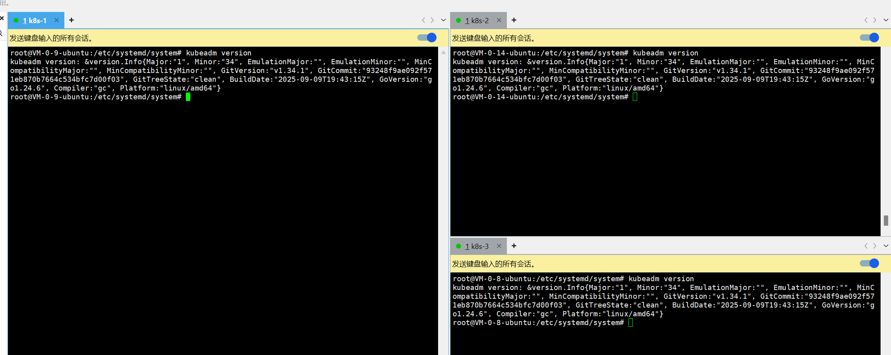
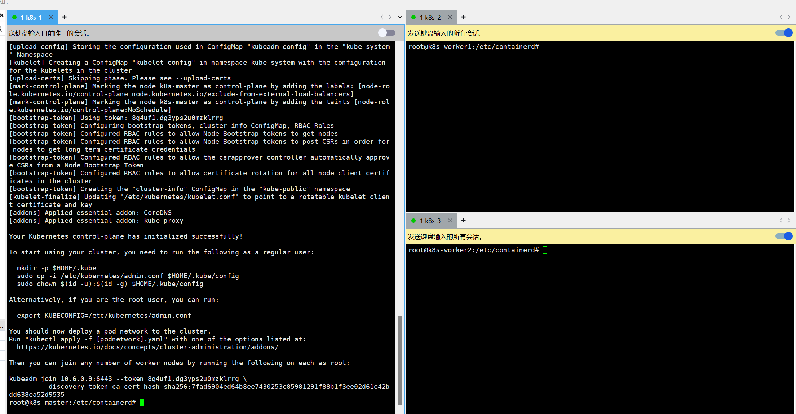

# K8S学习笔记

## 一，购买服务器

对比了腾讯云，阿里云，百度云。腾讯云价格更便宜，选择了腾讯云


## 二，安装Xshell

- [阿里云-在Ubuntu22.04 LTS上搭建Kubernetes集群](https://developer.aliyun.com/article/1445670)
- [Kubernetes k8s两万字超详细](https://blog.csdn.net/m0_53928179/article/details/139068769)
- [在Ubuntu22.04 LTS上搭建Kubernetes集群](https://blog.csdn.net/m0_51510236/article/details/136329885)

[Xshell](https://www.xshell.com/zh/free-for-home-school/)
方便同时控制多个服务器进行操作：工具->发送键输入到


## 三，安装K8S集群

- sudo su
- 关闭防火墙：
    - systemctl disable --now ufw
- 设置主机名称(单独执行)
    - 10.6.0.9机器：hostnamectl set-hostname k8s-master
    - 10.6.0.14机器：hostnamectl set-hostname k8s-worker1
    - 10.6.0.8机器：hostnamectl set-hostname k8s-worker2
    - 查看主机名：hostnamectl
      

- 配置hosts配置文件
    - vi /etc/hosts
    - 添加如下内容，内网ip

```
10.6.0.9 k8s-master
10.6.0.14 k8s-worker1
10.6.0.8 k8s-worker2
```

- 转发 IPv4 并让 iptables 看到桥接流量

#### 1. 写入 modules-load 配置文件

```
cat <<EOF | sudo tee /etc/modules-load.d/k8s.conf
overlay
br_netfilter
EOF
```

#### 2. 立即加载内核模块

```
sudo modprobe overlay
sudo modprobe br_netfilter
```

#### 3. 写入 sysctl 配置文件

```
cat <<EOF | sudo tee /etc/sysctl.d/k8s.conf
net.bridge.bridge-nf-call-iptables  = 1
net.bridge.bridge-nf-call-ip6tables = 1
net.ipv4.ip_forward                 = 1
EOF
```

#### 4. 立即应用 sysctl 配置

```
sudo sysctl --system
```

- 安装containerd

```
方式一，服务器下载：curl -LO https://github.com/containerd/containerd/releases/download/v2.1.4/containerd-2.1.4-linux-amd64.tar.gz
方式二：本地下载，再上传到服务器
解压：sudo tar -zxvf containerd-2.1.4-linux-amd64.tar.gz -C /usr/local
查看版本：containerd -v
配置：sudo mkdir /etc/containerd
创建配置文件：sudo containerd config default | sudo tee /etc/containerd/config.toml
修改config.toml文件：sudo vi /etc/containerd/config.toml
第一处：50行sandbox修改为：registry.aliyuncs.com/google_containers/pause:3.10
第二处：53行修改为：config_path = '/etc/containerd/certs.d'
第三处：107行ShimCgroup下边添加一行：SystemdCgroup = true
```

- 配置国内镜像源

```
创建目录：sudo mkdir -p /etc/containerd/certs.d/docker.io/
创建hosts文件：vi /etc/containerd/certs.d/docker.io/hosts.toml
将一下内容输入到hosts.toml文件中：
```

```
# 仓库地址（默认官方地址）
server = "https://docker.io"

# 配置镜像加速器（可选，例如添加国内镜像源）
[host."https://mirror.ccs.tencentyun.com"]
  capabilities = ["pull", "resolve"]  # 支持拉取和解析镜像
```

- 安装runc：

```
apt install -y runc
runc --version
```

- 手动创建containerd.service文件：

```
sudo tee /etc/systemd/system/containerd.service <<'EOF'
[Unit]
Description=containerd container runtime
Documentation=https://containerd.io
After=network.target

[Service]
ExecStartPre=-/sbin/modprobe overlay
ExecStart=/usr/local/bin/containerd
Restart=always
RestartSec=5
Delegate=yes
KillMode=process
OOMScoreAdjust=-999
LimitNOFILE=1048576
LimitNPROC=infinity
LimitCORE=infinity

[Install]
WantedBy=multi-user.target
EOF
```

- 启动并设置开机自启containerd

```
重新加载systemd配置：sudo systemctl daemon-reload
启动并设置开机自启：sudo systemctl enable --now containerd
检查状态：systemctl status containerd
重启服务：sudo systemctl restart containerd
```

**以上步骤完成之后，就可以开始安装kubernetes集群了**

### 安装kubernetes相关组件(1.34)

- apt update
- apt install -y apt-transport-https ca-certificates curl gpg

> curl -fsSL https://pkgs.k8s.io/core:/stable:/v1.34/deb/Release.key | sudo gpg --dearmor -o
> /etc/apt/keyrings/kubernetes-apt-keyring.gpg

> echo 'deb [signed-by=/etc/apt/keyrings/kubernetes-apt-keyring.gpg] https://pkgs.k8s.io/core:/stable:/v1.34/deb/ /' |
> sudo tee /etc/apt/sources.list.d/kubernetes.list

- apt update
- apt install -y kubelet kubeadm kubectl
- apt-mark hold kubelet kubeadm kubectl
- kubeadm version
  


- 主节点拉镜像

```
sudo kubeadm config images pull \
--image-repository=registry.aliyuncs.com/google_containers \
--kubernetes-version=v1.34.1 \
--cri-socket=unix:///run/containerd/containerd.sock
```


- 主节点初始化集群

```
sudo kubeadm init \
--apiserver-advertise-address=10.6.0.9 \
--image-repository=registry.aliyuncs.com/google_containers \
--kubernetes-version=v1.34.1 \
--service-cidr=10.96.0.0/12 \
--pod-network-cidr=10.244.0.0/16 \
--cri-socket=unix:///run/containerd/containerd.sock
```



- 执行输出的命令

```
mkdir -p $HOME/.kube
sudo cp -i /etc/kubernetes/admin.conf $HOME/.kube/config
sudo chown $(id -u):$(id -g) $HOME/.kube/config
```

- 主节点kubeadm init失败，重置命令

```
kubeadm reset -f
rm -rf /etc/cni/net.d
rm -rf /etc/kubernetes/
rm -rf ~/.kube/
rm -rf /var/lib/etcd/
systemctl restart containerd
systemctl restart kubelet
```

- 节点加入集群，记得放开主节点的6443端口

```
kubeadm join 10.6.0.9:6443 --token 8q4uf1.dg3yps2u0mzklrrg \
	--discovery-token-ca-cert-hash sha256:7fad6904ed64b8ee7430253c85981291f88b1f3ee02d61c42bdd638ea52d9535 \
        --cri-socket=unix:///var/run/containerd/containerd.sock -v=10
```


- master安装calico网络插件

```
kubectl create -f https://raw.githubusercontent.com/projectcalico/calico/v3.30.3/manifests/tigera-operator.yaml
kubectl create -f tigera-operator.yaml
curl -LO https://raw.githubusercontent.com/projectcalico/calico/v3.30.3/manifests/custom-resources.yaml
sed -i 's/cidr: 192.168.0.0/cidr: 10.244.0.0/g' custom-resources.yaml
kubectl create -f custom-resources.yaml
查看状态：watch kubectl get all -o wide -n calico-system
查看节点状态：kubectl get nodes -o wide
```

```calico清空操作
kubectl delete -f custom-resources.yaml
kubectl delete -f tigera-operator.yaml
kubectl delete namespace calico-system
kubectl delete crd installation.operator.tigera.io
kubectl delete crd tigerastatuses.operator.tigera.io
# 等待清理完成
kubectl wait --for=delete namespace/calico-system --timeout=60s
```

- 配置containerd的镜像源

```
crictl pull docker.io/calico/kube-controllers:v3.30.3
报错：FATA[0000] validate service connection: validate CRI v1 image API for endpoint "unix:///run/containerd/containerd.sock": rpc error: code = Unimplemented desc = unknown service runtime.v1.ImageService 

systemctl daemon-reload
systemctl restart containerd
systemctl status containerd

crictl info
sudo crictl images
crictl pull docker.io/calico/kube-controllers:v3.30.3
```


