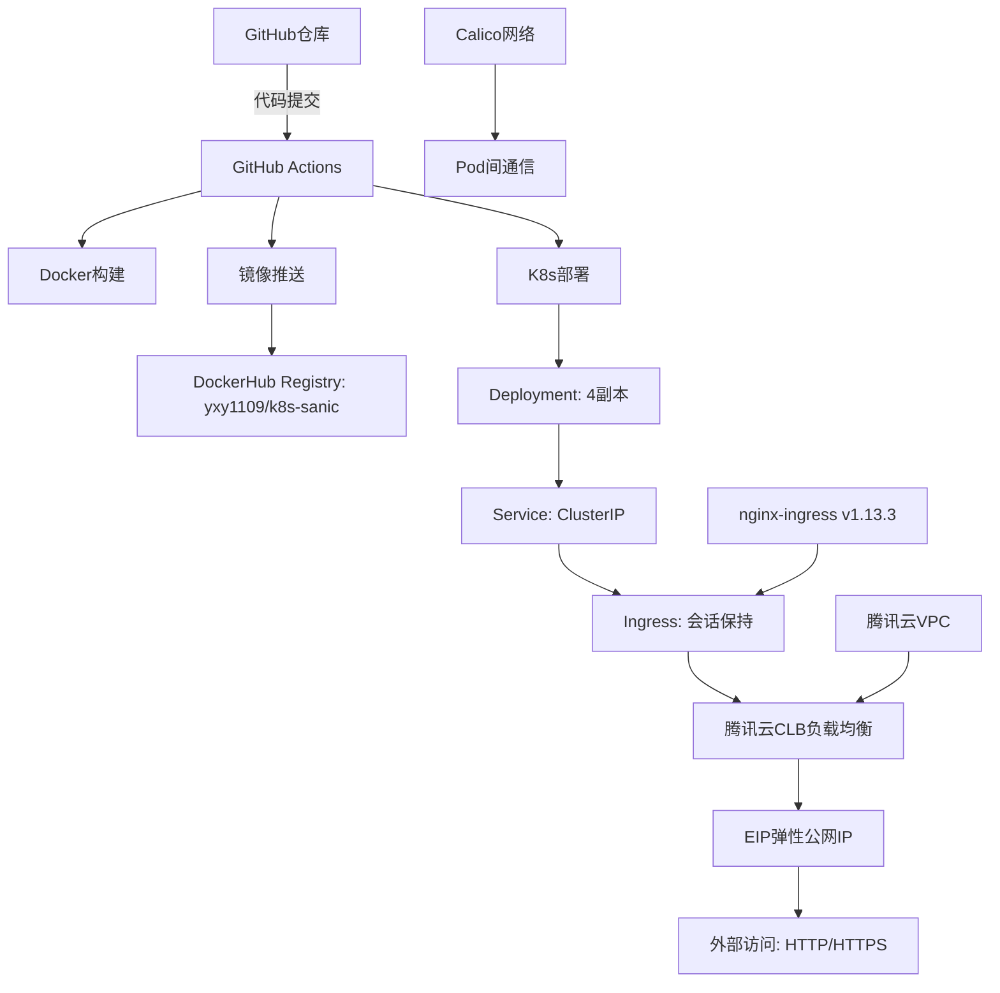

# K8s Sanic - 云原生Python Web服务部署指南

## 📋 项目概述

本项目展示如何将基于Sanic 25.3.0框架的高性能异步Python Web应用部署到Kubernetes集群，实现完整的CI/CD自动化流水线。项目包含容器化、Kubernetes编排、Ingress暴露和自动化部署等云原生最佳实践。

### 🎯 应用特点

- **高性能异步Web框架**: 基于Sanic 25.3.0，支持高并发访问
- **结构化日志**: 完整的请求/响应中间件和日志记录
- **健康检查**: 内置 `/health` 端点用于服务监控
- **生产就绪**: 4副本部署，滚动更新，自动故障恢复

### 🏗️ 架构组件



### 📁 项目结构

```
k8s_sanic/
├── app.py                          # Sanic Web应用主文件
├── requirements.txt                # Python依赖配置 (sanic>=25.3.0)
├── Dockerfile                      # Docker镜像构建文件 (python:3.11-slim)
├── readme.md                       # 项目文档
└── k8s/                            # Kubernetes配置目录
    ├── deployment.yaml             # 应用部署配置 (4副本, 健康检查)
    ├── service.yaml                # 服务暴露配置 (ClusterIP: 80→8000)
    ├── ingress.yaml                # Ingress路由配置 (高级优化配置)
    └── ingress-nginx-deploy.yaml   # nginx-ingress Controller完整部署
```

## 🚀 核心技术特性

### 🐍 应用层特性
- **Sanic 25.3.0**: 高性能异步Web框架
- **结构化日志**: 完整的请求ID追踪和响应时间记录
- **健康检查**: `/health` 端点用于服务状态监控
- **生产配置**: Keep-alive 75s，超时60s，监听 0.0.0.0:8000

### 🐳 容器化特性
- **轻量级镜像**: 基于 `python:3.11-slim`
- **时区优化**: `Asia/Shanghai` 时区设置
- **环境优化**: 不生成pyc文件，实时日志输出
- **安全配置**: 非特权用户运行

### ☸️ Kubernetes特性
- **4副本部署**: 高可用性配置
- **完整健康检查**: 启动探针(30次)、存活探针(3次)、就绪探针(2次)
- **资源限制**: CPU 200m-500m，内存 256Mi-512Mi
- **滚动更新**: 零停机部署策略

### 🌐 网络架构特性
- **云负载均衡**: 腾讯云CLB提供高可用负载均衡
- **弹性公网IP**: EIP提供稳定的公网访问入口
- **Ingress会话保持**: Cookie-based，1小时有效期
- **性能优化**: 连接池100，请求10000，超时60s
- **安全配置**: XSS防护、内容类型选项、框架保护
- **VPC网络**: 腾讯云私有网络保障网络安全

### 🔄 CI/CD特性
- **自动化触发**: main分支k8s_sanic目录变更或手动触发
- **多阶段构建**: Docker Buildx优化，支持缓存加速
- **时戳标签**: 基于部署时间生成版本标签 (格式: YYYYMMDD-HHMMSS)
- **顺序部署**: deployment → service → ingress 部署顺序
- **安全跳过**: 跳过TLS验证和webhook验证适配云环境

## 📡 API接口文档

### 🔗 端点列表

| 方法 | 端点 | 描述 | 响应格式 |
|------|------|------|----------|
| GET | `/` | 主页端点，返回问候消息和时间戳 | JSON |
| GET | `/health` | 健康检查端点，用于服务监控 | JSON |

### 📝 接口详情

#### 1. 主页接口

**请求**: `GET /`

**响应示例**:
```json
{
  "message": "Hello from Sanic on K8s!",
  "timestamp": "2024-01-20 10:30:45",
  "request_id": "req_123456789"
}
```

#### 2. 健康检查接口

**请求**: `GET /health`

**响应示例**:
```json
{
  "status": "healthy",
  "timestamp": "2024-01-20 10:30:45"
}
```

### 🔧 中间件功能

- **请求中间件**: 自动生成request_id，记录请求路径和方法
- **响应中间件**: 记录请求完成状态和处理时间
- **日志格式**: 结构化JSON格式，包含时间戳、级别、消息和上下文信息

## ⚙️ 部署前准备

### 1. 云环境要求

- **云平台**: 腾讯云TKE或自建K8s集群
- **Kubernetes版本**: 1.20+
- **网络组件**:
  - Calico CNI网络插件
  - nginx-ingress Controller
- **负载均衡**: 腾讯云CLB (负载均衡服务)
- **公网访问**: EIP (弹性公网IP)

### 2. 集群配置

- **节点数量**: 至少3个节点（1个Master + 2个Worker）
- **容器运行时**: Docker或containerd
- **VPC网络**: 腾讯云私有网络环境
- **子网配置**: 确保CLB可以访问K8s节点

### 3. 系统配置

#### IPv4/IPv6转发（所有节点）

```bash
# 检查当前状态
sysctl net.ipv4.ip_forward
sysctl net.ipv6.conf.all.forwarding

# 启用转发（如果为0）
sudo sysctl -w net.ipv4.ip_forward=1
sudo sysctl -w net.ipv6.conf.all.forwarding=1
sudo sysctl -p
```

#### 防火墙端口配置

```bash
# Calico网络端口
TCP 179    # BGP协议
UDP 4789   # VXLAN封装
TCP 5473   # Typha组件

# 应用端口
TCP 80     # HTTP访问
TCP 443    # HTTPS访问
```

### 4. 腾讯云资源配置

在腾讯云控制台提前准备以下资源：

| 资源类型 | 说明 | 配置建议 |
|---------|------|----------|
| **VPC** | 私有网络 | 与K8s集群同VPC |
| **CLB** | 负载均衡 | 公网类型，支持HTTP/HTTPS |
| **EIP** | 弹性公网IP | 绑定到CLB提供公网访问 |
| **子网** | 网络子网 | 确保与K8s节点网络互通 |

### 5. GitHub Secrets配置

在仓库设置中配置以下密钥：

| 密钥名称                 | 描述            | 获取方式                          |
|----------------------|---------------|-------------------------------|
| `DOCKERHUB_USERNAME` | DockerHub用户名  | DockerHub账户                   |
| `DOCKERHUB_TOKEN`    | DockerHub访问令牌 | 账户设置 → Personal Access Tokens |
| `KUBE_CONFIG`        | K8s集群配置       | `kubectl config view --raw`   |

### 📋 GitHub Actions工作流流程

**触发条件**:
- 推送到main分支且影响 `k8s_sanic/` 目录的文件变更
- 手动触发 (workflow_dispatch)

**工作流位置**: `.github/workflows/deploy.yml` (根目录)

#### 构建阶段 (build-push job)
1. **获取代码** - 检出仓库代码
2. **设置Buildx** - 配置Docker Buildx构建环境
3. **登录DockerHub** - 使用Secrets认证
4. **生成标签** - 基于上海时区生成时间戳标签 (YYYYMMDD-HHMMSS)
5. **构建推送** - 构建镜像并推送到DockerHub (latest + 时间戳标签)

#### 部署阶段 (deploy job)
1. **获取代码** - 检出仓库代码
2. **安装kubectl** - 使用官方Azure action安装kubectl工具
3. **配置集群** - 使用kubeconfig连接K8s集群
4. **应用部署** - 按顺序应用K8s配置文件
   - deployment.yaml (应用部署)
   - service.yaml (服务配置)
   - ingress.yaml (入口路由)
5. **重启应用** - 滚动重启deployment确保更新

**特殊配置**:
- 使用 `--insecure-skip-tls-verify` 跳过TLS验证适配云环境
- 跳过ingress webhook验证避免云环境冲突
- 利用GitHub Actions缓存加速构建过程

## 🚀 快速开始指南

### 🏃‍♂️ 一键部署 (推荐)

**前提条件**: 已配置好GitHub Secrets

```bash
# 1. 克隆仓库
git clone <your-repo-url>
cd docker_compose_learn/k8s_sanic

# 2. 推送代码触发部署
git add .
git commit -m "feat: 初始部署K8s Sanic应用"
git push origin main

# 3. 监控部署状态
watch kubectl get pods -l app=sanic-app
```

### 🧪 本地测试

```bash
# 1. 安装依赖
pip install -r requirements.txt

# 2. 启动本地服务
python app.py

# 3. 测试接口
curl http://localhost:8000/
curl http://localhost:8000/health
```

### 🐳 Docker本地测试

```bash
# 1. 构建镜像
docker build -t k8s-sanic:test .

# 2. 运行容器
docker run -d -p 8000:8000 --name sanic-test k8s-sanic:test

# 3. 测试服务
curl http://localhost:8000/health
```

## 📊 部署验证清单

### ✅ 部署成功检查项

- [ ] **集群状态**: `kubectl get nodes` 显示所有节点Ready
- [ ] **Ingress Controller**: `kubectl get pods -n ingress-nginx` 运行正常
- [ ] **应用Pod**: `kubectl get pods -l app=sanic-app` 4个副本Running
- [ ] **服务发现**: `kubectl get svc sanic-app-service` ClusterIP已分配
- [ ] **Ingress路由**: `kubectl get ingress sanic-app-ingress` 配置正确
- [ ] **CLB状态**: 腾讯云控制台CLB运行正常，EIP已绑定
- [ ] **公网访问**: `curl http://<CLB-EIP>/health` 返回healthy
- [ ] **会话保持**: 多次请求返回相同的request_id

### 🔍 故障排查命令

```bash
# 查看完整资源状态
kubectl get all -l app=sanic-app

# 查看Pod日志
kubectl logs -f deployment/sanic-app-deployment

# 查看事件
kubectl get events --sort-by=.metadata.creationTimestamp

# 进入Pod调试
kubectl exec -it deployment/sanic-app-deployment -- /bin/bash
```

#### DockerHub Token生成步骤：

1. 登录 [DockerHub](https://app.docker.com)
2. 点击右上角头像 → Account Settings
3. 左侧选择 Personal access tokens → Generate new token
4. 创建令牌并复制到GitHub Secrets

#### KubeConfig配置步骤：

1. 在Master节点执行：`kubectl config view --raw`
2. 将集群内网IP替换为公网IP
3. 复制完整配置到GitHub Secrets的`KUBE_CONFIG`

## 🛠️ 部署指南

### 第一阶段：部署Ingress Controller

#### 1. 使用项目提供的部署文件

```bash
# 进入k8s配置目录
cd k8s_sanic/k8s

# 部署nginx-ingress Controller
kubectl apply -f ingress-nginx-deploy.yaml

# 验证部署状态
kubectl get pods -n ingress-nginx
kubectl get svc -n ingress-nginx
```

**说明**: 项目已提供适配腾讯云环境的ingress-nginx部署文件，使用阿里云镜像源解决网络访问问题。

#### 2. 验证Ingress Controller运行状态

```bash
# 检查Controller Pod
kubectl get pods -n ingress-nginx -l app.kubernetes.io/name=ingress-nginx

# 检查服务状态
kubectl get svc -n ingress-nginx

# 查看Controller日志
kubectl logs -n ingress-nginx -l app.kubernetes.io/name=ingress-nginx
```

### 第二阶段：配置CLB和EIP

#### 1. 在腾讯云控制台操作

1. **创建CLB负载均衡**
   - 选择公网负载均衡
   - 网络类型选择与K8s集群相同的VPC
   - 监听器配置HTTP(80)和HTTPS(443)

2. **绑定EIP**
   - 为CLB绑定弹性公网IP
   - 确保EIP有足够的带宽

3. **配置后端服务**
   - 将Ingress Controller的Service (LoadBalancer类型) 作为后端
   - 健康检查指向Ingress Controller的端口

#### 2. 验证CLB配置

```bash
# 获取Ingress Controller外部IP
kubectl get svc -n ingress-nginx ingress-nginx-controller

# 通过CLB的EIP访问测试
curl http://<CLB-EIP>/
```

### 第三阶段：自动化部署

#### 1. 触发CI/CD流水线

```bash
# 方式1：推送代码触发
git add .
git commit -m "deploy: 更新应用版本"
git push origin main

# 方式2：手动触发
# 在GitHub Actions页面选择"workflow_dispatch"
```

#### 2. 监控部署状态

```bash
# 查看部署状态
kubectl get pods -l app=sanic-app
kubectl get svc sanic-app-service
kubectl get ingress sanic-app-ingress

# 查看应用日志
kubectl logs -f deployment/sanic-app-deployment

# 检查资源使用
kubectl top pods -l app=sanic-app
```

## 🧪 验证部署

### 1. 服务可用性测试

```bash
# 获取CLB的EIP地址
CLB_EIP="<腾讯云CLB绑定的EIP地址>"

# 测试API端点
curl http://$CLB_EIP/
curl http://$CLB_EIP/health

# 检查响应时间
curl -w "@curl-format.txt" -o /dev/null -s http://$CLB_EIP/health
```

**创建curl-format.txt文件**:
```
     time_namelookup:  %{time_namelookup}\n
        time_connect:  %{time_connect}\n
     time_appconnect:  %{time_appconnect}\n
    time_pretransfer:  %{time_pretransfer}\n
       time_redirect:  %{time_redirect}\n
  time_starttransfer:  %{time_starttransfer}\n
                     ----------\n
          time_total:  %{time_total}\n
```

### 2. 负载均衡和会话保持测试

```bash
# 并发测试 - 检查负载分发
for i in {1..10}; do
  curl -s -c cookies.txt http://$CLB_EIP/ | jq -r '.timestamp'
done

# 会话保持测试 - 使用相同的Cookie
for i in {1..5}; do
  curl -s -b cookies.txt http://$CLB_EIP/ | jq -r '.request_id'
done

# 压力测试
ab -n 1000 -c 10 http://$CLB_EIP/health
```

## 🔧 运维管理

### 日常操作命令

#### 应用管理

```bash
# 重启应用
kubectl rollout restart deployment/sanic-app-deployment

# 扩缩容
kubectl scale deployment sanic-app-deployment --replicas=6

# 滚动更新
kubectl set image deployment/sanic-app-deployment sanic-app-container=yxy1109/k8s-sanic:v2.0

# 回滚部署
kubectl rollout undo deployment/sanic-app-deployment
```

#### 集群诊断

```bash
# 查看资源使用情况
kubectl describe nodes
kubectl top nodes

# 查看事件
kubectl get events --sort-by=.metadata.creationTimestamp

# 网络连通性测试
kubectl exec -it deployment/sanic-app-deployment -- ping 8.8.8.8
```

### 故障排除

#### Calico网络问题

```bash
# 检查Calico组件状态
kubectl get pods -n calico-system

# 重启Calico节点
kubectl delete pod -n calico-system -l k8s-app=calico-node

# 检查网络策略
kubectl get networkpolicies --all-namespaces
```

#### Ingress问题

```bash
# 检查Ingress Controller日志
kubectl logs -n ingress-nginx -l app.kubernetes.io/name=ingress-nginx

# 验证Ingress配置
kubectl describe ingress sanic-app-ingress

# 测试Ingress规则
kubectl exec -n ingress-nginx deployment/ingress-nginx-controller -- cat /etc/nginx/nginx.conf
```

#### CLB和EIP问题

```bash
# 检查Ingress Controller服务状态
kubectl get svc -n ingress-nginx ingress-nginx-controller -o wide

# 检查网络连通性
kubectl exec -it deployment/sanic-app-deployment -- ping <CLB-EIP>

# 查看腾讯云控制台
# 1. CLB负载均衡状态
# 2. EIP绑定状态
# 3. 监听器配置
# 4. 健康检查状态

# 测试直接访问Ingress Controller
INGRESS_IP=$(kubectl get svc -n ingress-nginx ingress-nginx-controller -o jsonpath='{.status.loadBalancer.ingress[0].ip}')
curl http://$INGRESS_IP/
```

## 📊 监控指标

### 应用指标

- **QPS**: 每秒请求数
- **响应时间**: P50/P95/P99延迟
- **错误率**: 4xx/5xx错误占比
- **可用性**: 服务健康状态

### 基础设施指标

- **CPU使用率**: 容器资源消耗
- **内存使用率**: 内存占用情况
- **网络流量**: 入站/出站带宽
- **磁盘I/O**: 存储性能指标

## 🔒 安全配置

### 网络安全

```yaml
# 网络策略示例
apiVersion: networking.k8s.io/v1
kind: NetworkPolicy
metadata:
  name: sanic-app-netpol
spec:
  podSelector:
    matchLabels:
      app: sanic-app
  policyTypes:
    - Ingress
    - Egress
  ingress:
    - from:
        - namespaceSelector:
            matchLabels:
              name: ingress-nginx
      ports:
        - protocol: TCP
          port: 8000
```

### RBAC配置

```yaml
# 服务账户配置
apiVersion: v1
kind: ServiceAccount
metadata:
  name: sanic-app-sa
---
apiVersion: rbac.authorization.k8s.io/v1
kind: Role
metadata:
  name: sanic-app-role
rules:
  - apiGroups: [ "" ]
    resources: [ "configmaps" ]
    verbs: [ "get", "list" ]
```

## 📈 性能优化

### 应用层优化

- **连接池**: 使用连接池管理数据库连接
- **缓存策略**: Redis缓存热点数据
- **异步处理**: 使用异步I/O提升并发性能

### Kubernetes优化

- **资源限制**: 合理设置CPU/内存限制
- **亲和性规则**: 优化Pod调度策略
- **水平扩缩容**: 配置HPA自动扩缩容

## 🆘 支持与反馈

如遇到问题，请提供以下信息：

1. 集群版本和配置
2. 相关Pod日志
3. 错误信息和事件
4. 网络环境描述

---

**注意**: 本文档基于实际生产环境经验编写，具体配置请根据实际环境调整。