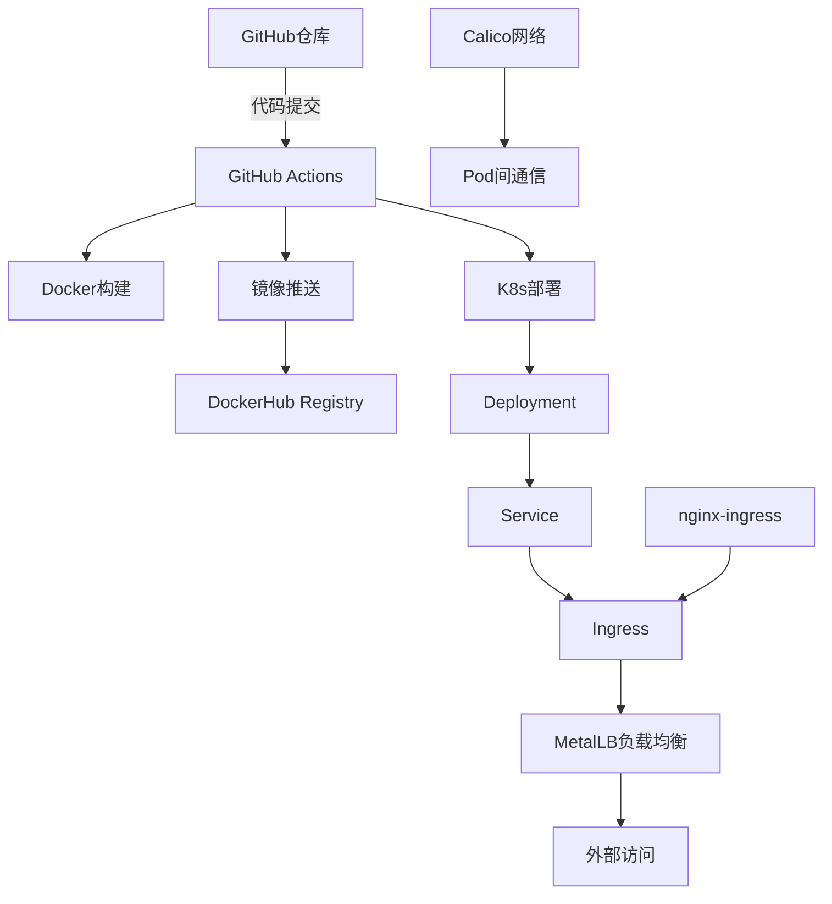

# K8s Sanic - 云原生Python Web服务部署指南

## 📋 项目概述

本项目展示如何将基于Sanic框架的Python Web应用部署到Kubernetes集群，实现完整的CI/CD自动化流水线。项目包含容器化、Kubernetes编排、Ingress暴露和自动化部署等云原生最佳实践。

### 🏗️ 架构组件



### 📁 项目结构

```
k8s_sanic/
├── app.py                  # Sanic Web应用
├── requirements.txt        # Python依赖
├── Dockerfile             # Docker镜像构建文件
├── README.md              # 项目文档
└── k8s/                   # Kubernetes配置文件
    ├── deployment.yaml     # 部署配置
    ├── service.yaml        # 服务配置
    ├── ingress.yaml        # Ingress配置
    ├── metallb-config.yaml # MetalLB配置
    ├── metallb-native.yaml # MetalLB清单文件
    └── ingress-nginx-deploy.yaml # Ingress Controller部署
```

## 🚀 功能特性

- **容器化应用**: 基于Python 3.11-slim的轻量级镜像
- **健康检查**: 完整的存活、就绪和启动探针配置
- **自动扩缩容**: 支持4副本部署和滚动更新
- **负载均衡**: MetalLB + Ingress Controller实现外部访问
- **CI/CD自动化**: GitHub Actions实现构建、推送和部署自动化
- **监控日志**: 结构化日志记录和请求追踪

## ⚙️ 部署前准备

### 1. 集群要求

- **Kubernetes版本**: 1.20+
- **节点数量**: 至少3个节点（1个Master + 2个Worker）
- **网络插件**: Calico CNI
- **容器运行时**: Docker或containerd

### 2. 系统配置

#### IPv4/IPv6转发（所有节点）
```bash
# 检查当前状态
sysctl net.ipv4.ip_forward
sysctl net.ipv6.conf.all.forwarding

# 启用转发（如果为0）
sudo sysctl -w net.ipv4.ip_forward=1
sudo sysctl -w net.ipv6.conf.all.forwarding=1
sudo sysctl -p
```

#### 防火墙端口配置
```bash
# Calico网络端口
TCP 179    # BGP协议
UDP 4789   # VXLAN封装
TCP 5473   # Typha组件

# 应用端口
TCP 80     # HTTP访问
TCP 443    # HTTPS访问
TCP 30080  # NodePort（如使用）
```

### 3. GitHub Secrets配置

在仓库设置中配置以下密钥：

| 密钥名称 | 描述 | 获取方式 |
|---------|------|----------|
| `DOCKERHUB_USERNAME` | DockerHub用户名 | DockerHub账户 |
| `DOCKERHUB_TOKEN` | DockerHub访问令牌 | 账户设置 → Personal Access Tokens |
| `KUBE_CONFIG` | K8s集群配置 | `kubectl config view --raw` |

#### DockerHub Token生成步骤：
1. 登录 [DockerHub](https://app.docker.com)
2. 点击右上角头像 → Account Settings
3. 左侧选择 Personal access tokens → Generate new token
4. 创建令牌并复制到GitHub Secrets

#### KubeConfig配置步骤：
1. 在Master节点执行：`kubectl config view --raw`
2. 将集群内网IP替换为公网IP
3. 复制完整配置到GitHub Secrets的`KUBE_CONFIG`

## 🛠️ 部署指南

### 第一阶段：安装Ingress Controller

#### 1. 下载并修改部署文件
```bash
# 下载官方部署文件
wget https://raw.githubusercontent.com/kubernetes/ingress-nginx/controller-v1.13.3/deploy/static/provider/cloud/deploy.yaml

# 备份原文件
cp deploy.yaml ingress-nginx-deploy.yaml
```

#### 2. 替换镜像源（解决网络访问问题）
```bash
# 替换Controller镜像
sed -i 's|registry.k8s.io/ingress-nginx/controller:v1.13.3@sha256:.*|registry.cn-hangzhou.aliyuncs.com/google_containers/nginx-ingress-controller:v1.13.3|g' ingress-nginx-deploy.yaml

# 替换Webhook Certgen镜像（两处）
sed -i 's|registry.k8s.io/ingress-nginx/kube-webhook-certgen:v1.6.3@sha256:.*|registry.cn-hangzhou.aliyuncs.com/google_containers/kube-webhook-certgen:v1.6.3|g' ingress-nginx-deploy.yaml
```

#### 3. 部署Ingress Controller
```bash
kubectl apply -f ingress-nginx-deploy.yaml

# 验证部署状态
kubectl get pods -n ingress-nginx
kubectl get svc -n ingress-nginx
```

### 第二阶段：安装MetalLB负载均衡器

#### 1. 部署MetalLB
```bash
# 下载并部署MetalLB
kubectl apply -f https://raw.githubusercontent.com/metallb/metallb/v0.15.2/config/manifests/metallb-native.yaml

# 跳过Webhook校验（如需要）
kubectl delete validatingwebhookconfigurations.admissionregistration.k8s.io metallb-webhook-configuration
```

#### 2. 配置IP地址池
```yaml
# metallb-config.yaml
apiVersion: metallb.io/v1beta1
kind: IPAddressPool
metadata:
  name: public-pool
  namespace: metallb-system
spec:
  addresses:
  - 192.168.1.100-192.168.1.120  # 根据实际网络环境调整
---
apiVersion: metallb.io/v1beta1
kind: L2Advertisement
metadata:
  name: empty
  namespace: metallb-system
spec:
  ipAddressPools:
  - public-pool
```

```bash
kubectl apply -f metallb-config.yaml

# 验证MetalLB状态
kubectl get pods -n metallb-system
kubectl get svc -n ingress-nginx ingress-nginx-controller
```

### 第三阶段：自动化部署

#### 1. 触发CI/CD流水线
```bash
# 方式1：推送代码触发
git add .
git commit -m "deploy: 更新应用版本"
git push origin main

# 方式2：手动触发
# 在GitHub Actions页面选择"workflow_dispatch"
```

#### 2. 监控部署状态
```bash
# 查看部署状态
kubectl get pods -l app=sanic-app
kubectl get svc sanic-app-service
kubectl get ingress sanic-app-ingress

# 查看应用日志
kubectl logs -f deployment/sanic-app-deployment

# 检查资源使用
kubectl top pods -l app=sanic-app
```

## 🧪 验证部署

### 1. 服务可用性测试
```bash
# 获取Ingress外部IP
EXTERNAL_IP=$(kubectl get ingress sanic-app-ingress -o jsonpath='{.status.loadBalancer.ingress[0].ip}')

# 测试API端点
curl http://$EXTERNAL_IP/
curl http://$EXTERNAL_IP/health
```

### 2. 负载均衡测试
```bash
# 并发测试
for i in {1..10}; do
  curl -s http://$EXTERNAL_IP/ | jq -r '.message'
done
```

## 🔧 运维管理

### 日常操作命令

#### 应用管理
```bash
# 重启应用
kubectl rollout restart deployment/sanic-app-deployment

# 扩缩容
kubectl scale deployment sanic-app-deployment --replicas=6

# 滚动更新
kubectl set image deployment/sanic-app-deployment sanic-app-container=yxy1109/k8s-sanic:v2.0

# 回滚部署
kubectl rollout undo deployment/sanic-app-deployment
```

#### 集群诊断
```bash
# 查看资源使用情况
kubectl describe nodes
kubectl top nodes

# 查看事件
kubectl get events --sort-by=.metadata.creationTimestamp

# 网络连通性测试
kubectl exec -it deployment/sanic-app-deployment -- ping 8.8.8.8
```

### 故障排除

#### Calico网络问题
```bash
# 检查Calico组件状态
kubectl get pods -n calico-system

# 重启Calico节点
kubectl delete pod -n calico-system -l k8s-app=calico-node

# 检查网络策略
kubectl get networkpolicies --all-namespaces
```

#### Ingress问题
```bash
# 检查Ingress Controller日志
kubectl logs -n ingress-nginx -l app.kubernetes.io/name=ingress-nginx

# 验证Ingress配置
kubectl describe ingress sanic-app-ingress

# 测试Ingress规则
kubectl exec -n ingress-nginx deployment/ingress-nginx-controller -- cat /etc/nginx/nginx.conf
```

#### MetalLB问题
```bash
# 检查MetalLB状态
kubectl get pods -n metallb-system
kubectl get ipaddresspools -n metallb-system

# 查看IP分配情况
kubectl get services -l metallb.universe.tf/address-pool=public-pool
```

## 📊 监控指标

### 应用指标
- **QPS**: 每秒请求数
- **响应时间**: P50/P95/P99延迟
- **错误率**: 4xx/5xx错误占比
- **可用性**: 服务健康状态

### 基础设施指标
- **CPU使用率**: 容器资源消耗
- **内存使用率**: 内存占用情况
- **网络流量**: 入站/出站带宽
- **磁盘I/O**: 存储性能指标

## 🔒 安全配置

### 网络安全
```yaml
# 网络策略示例
apiVersion: networking.k8s.io/v1
kind: NetworkPolicy
metadata:
  name: sanic-app-netpol
spec:
  podSelector:
    matchLabels:
      app: sanic-app
  policyTypes:
  - Ingress
  - Egress
  ingress:
  - from:
    - namespaceSelector:
        matchLabels:
          name: ingress-nginx
    ports:
    - protocol: TCP
      port: 8000
```

### RBAC配置
```yaml
# 服务账户配置
apiVersion: v1
kind: ServiceAccount
metadata:
  name: sanic-app-sa
---
apiVersion: rbac.authorization.k8s.io/v1
kind: Role
metadata:
  name: sanic-app-role
rules:
- apiGroups: [""]
  resources: ["configmaps"]
  verbs: ["get", "list"]
```

## 📈 性能优化

### 应用层优化
- **连接池**: 使用连接池管理数据库连接
- **缓存策略**: Redis缓存热点数据
- **异步处理**: 使用异步I/O提升并发性能

### Kubernetes优化
- **资源限制**: 合理设置CPU/内存限制
- **亲和性规则**: 优化Pod调度策略
- **水平扩缩容**: 配置HPA自动扩缩容

## 🆘 支持与反馈

如遇到问题，请提供以下信息：
1. 集群版本和配置
2. 相关Pod日志
3. 错误信息和事件
4. 网络环境描述

---

**注意**: 本文档基于实际生产环境经验编写，具体配置请根据实际环境调整。