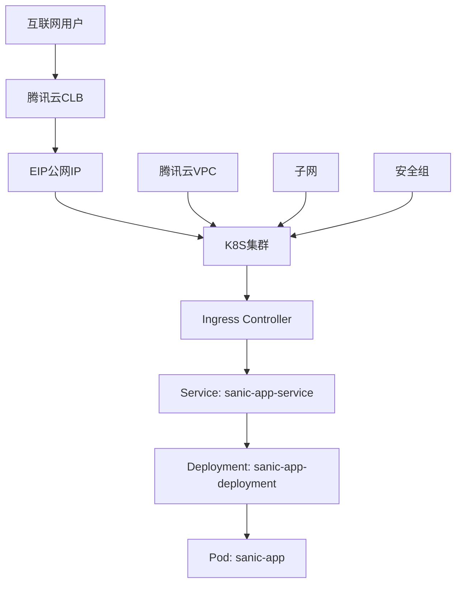

# 腾讯云EIP+CLB+K8S公网访问详细教程

## 📋 概述

本教程详细介绍如何在腾讯云上配置EIP（弹性公网IP）+ CLB（负载均衡）+ Kubernetes集群，实现服务的公网访问。基于您现有的k8s_sanic项目，提供完整的配置指南和最佳实践。

### 🏗️ 架构设计



## 🚀 第一阶段：腾讯云基础资源配置

### 1. 购买和配置EIP

#### 1.1 申请EIP
```bash
# 登录腾讯云控制台
# 导航：弹性公网IP → 弹性公网IP列表 → 申请
```

**EIP配置参数：**
- **地域**：选择与K8S集群相同的地域
- **计费模式**：按带宽计费（生产环境）或按流量计费（测试环境）
- **带宽上限**：根据业务需求选择（建议5Mbps起）
- **网络类型**：BGP（多线）
- **数量**：1个

#### 1.2 EIP绑定准备
```bash
# 记录EIP信息
EIP_ID="eip-xxxxx"        # EIP实例ID
EIP_ADDRESS="1.2.3.4"     # 分配的公网IP地址
```

### 2. 创建CLB负载均衡

#### 2.1 创建CLB实例
```bash
# 导航：负载均衡 → 实例管理 → 新建
```

**CLB配置参数：**
- **实例名称**：k8s-sanic-clb
- **地域**：与EIP和K8S集群相同
- **网络类型**：公网
- **实例类型**：标准型
- **IP版本**：IPv4
- **带宽**：5Mbps（或与EIP带宽一致）

#### 2.2 绑定EIP
```bash
# 在CLB实例列表中，选择刚创建的CLB
# 操作栏：更多 → 绑定EIP
# 选择之前申请的EIP
```

#### 2.3 配置安全组
```bash
# 导航：云服务器 → 安全组 → 新建
# 安全组配置：
- 名称：k8s-sanic-sg
- 入站规则：
  * TCP:80  来源：0.0.0.0/0（HTTP访问）
  * TCP:443 来源：0.0.0.0/0（HTTPS访问）
  * TCP:30080 来源：0.0.0.0/0（NodePort访问）
  * TCP:6443 来源：Master节点IP/32（API Server）
- 出站规则：允许所有（默认）
```

## 🔧 第二阶段：K8S集群配置

### 1. 修改Service配置

基于您现有的`service.yaml`，适配腾讯云CLB：

```yaml
# k8s/service-tencent.yaml
apiVersion: v1
kind: Service
metadata:
  name: sanic-app-service
  namespace: default
  annotations:
    # 腾讯云CLB相关注解
    service.kubernetes.io/qcloud-loadbalancer-internal-subnetid: "subnet-xxxxx"  # 内网子网ID
    service.kubernetes.io/qcloud-loadbalancer-cls-new: "cls-xxxxx"  # CLB实例ID
    service.kubernetes.io/qcloud-loadbalancer-cls-type: "public"
    service.kubernetes.io/qcloud-loadbalancer-cls-vip: "1.2.3.4"  # EIP地址

    # 会话亲和性
    service.kubernetes.io/qcloud-loadbalancer-session-affinity-option: "enabled"
    service.kubernetes.io/qcloud-loadbalancer-session-affinity-timeout: "3600"

    # 健康检查配置
    service.kubernetes.io/qcloud-loadbalancer-health-check-flag: "on"
    service.kubernetes.io/qcloud-loadbalancer-health-check-interval: "5"
    service.kubernetes.io/qcloud-loadbalancer-health-check-timeout: "3"
    service.kubernetes.io/qcloud-loadbalancer-health-check-num-threshold: "3"
    service.kubernetes.io/qcloud-loadbalancer-health-check-http-code: "2xx,3xx"
    service.kubernetes.io/qcloud-loadbalancer-health-check-http-path: "/health"

    # 传统MetalLB注解（保留兼容性）
    metallb.universe.tf/address-pool: public-pool
spec:
  selector:
    app: sanic-app
  ports:
    - name: http
      port: 80
      targetPort: 8000
      protocol: TCP
  type: LoadBalancer
  externalTrafficPolicy: Local
  sessionAffinity: ClientIP
  sessionAffinityConfig:
    clientIP:
      timeoutSeconds: 3600
```

### 2. 更新Ingress配置

优化Ingress配置以适配腾讯云环境：

```yaml
# k8s/ingress-tencent.yaml
apiVersion: networking.k8s.io/v1
kind: Ingress
metadata:
  name: sanic-app-ingress
  namespace: default
  annotations:
    # 会话亲和性
    nginx.ingress.kubernetes.io/affinity: "cookie"
    nginx.ingress.kubernetes.io/session-cookie-name: "sanic-affinity"
    nginx.ingress.kubernetes.io/session-cookie-max-age: "3600"

    # 超时配置
    nginx.ingress.kubernetes.io/proxy-connect-timeout: "30"
    nginx.ingress.kubernetes.io/proxy-send-timeout: "600"
    nginx.ingress.kubernetes.io/proxy-read-timeout: "600"

    # 重试机制
    nginx.ingress.kubernetes.io/retry-number: "3"
    nginx.ingress.kubernetes.io/retry-interval: "5"

    # 连接保持
    nginx.ingress.kubernetes.io/upstream-keepalive-connections: "100"
    nginx.ingress.kubernetes.io/upstream-keepalive-requests: "10000"
    nginx.ingress.kubernetes.io/upstream-keepalive-timeout: "60"

    # 腾讯云特定注解
    nginx.ingress.kubernetes.io/rewrite-target: /
    nginx.ingress.kubernetes.io/ssl-redirect: "false"
    nginx.ingress.kubernetes.io/force-ssl-redirect: "false"
spec:
  ingressClassName: nginx
  rules:
    - http:
        paths:
          - path: /
            pathType: Prefix
            backend:
              service:
                name: sanic-app-service
                port:
                  number: 80
```

### 3. 部署更新配置

```bash
# 应用新配置
kubectl apply -f k8s/deployment.yaml
kubectl apply -f k8s/service-tencent.yaml
kubectl apply -f k8s/ingress-tencent.yaml

# 检查服务状态
kubectl get pods -l app=sanic-app
kubectl get svc sanic-app-service
kubectl get ingress sanic-app-ingress
```

## 🌐 第三阶段：CLB监听器配置

### 1. 配置HTTP监听器

#### 1.1 添加监听器
```bash
# 在CLB控制台，选择目标CLB实例
# 操作栏：管理 → 监听器管理 → 新建监听器
```

**HTTP监听器配置：**
- **监听端口**：80
- **监听协议**：HTTP
- **转发策略**：按权重
- **健康检查**：开启
  * 检查路径：/health
  * 检查端口：80
  * 检查间隔：5秒
  * 响应超时：3秒
  * 健康阈值：3次
  * 不健康阈值：3次

#### 1.2 绑定后端服务
```bash
# 在监听器中添加转发规则
- 域名：*（或您的域名）
- URL路径：/*
- 均衡方式：轮询
- 会话保持：开启（按源IP）
- 后端服务器：K8S集群节点IP:30080（NodePort）
```

### 2. 配置HTTPS监听器（可选）

#### 2.1 上传SSL证书
```bash
# 导航：SSL证书 → 证书管理 → 上传证书
- 证书名称：sanic-app-ssl
- 证书内容：粘贴您的.crt文件内容
- 私钥内容：粘贴您的.key文件内容
```

#### 2.2 配置HTTPS监听器
```bash
# 新建HTTPS监听器
- 监听端口：443
- 监听协议：HTTPS
- SSL证书：选择刚上传的证书
- 其他配置与HTTP监听器相同
```

## 🚀 第四阶段：部署和验证

### 1. 完整部署流程

```bash
# 1. 确保Ingress Controller运行正常
kubectl get pods -n ingress-nginx

# 2. 部署应用
kubectl apply -f k8s/deployment.yaml
kubectl apply -f k8s/service-tencent.yaml
kubectl apply -f k8s/ingress-tencent.yaml

# 3. 等待Service获取外部IP
kubectl get svc sanic-app-service --watch

# 4. 验证Ingress状态
kubectl get ingress sanic-app-ingress
```

### 2. 服务访问测试

#### 2.1 获取访问地址
```bash
# 获取EIP地址
EIP_IP="1.2.3.4"  # 您的EIP地址

# 获取CLB域名（如果有）
CLB_DOMAIN="cls-xxxxx.ap-guangzhou.elb.tencentcloudapi.com"
```

#### 2.2 功能测试
```bash
# 基础连通性测试
curl -I http://$EIP_IP/
curl -I http://$EIP_IP/health

# API功能测试
curl http://$EIP_IP/ | jq
curl http://$EIP_IP/health | jq

# 负载均衡测试
for i in {1..10}; do
  echo "请求 $i:"
  curl -s http://$EIP_IP/ | jq -r '.hostname // .message'
  sleep 0.1
done

# 并发压力测试
ab -n 1000 -c 50 http://$EIP_IP/
```

### 3. 监控和日志

#### 3.1 服务状态监控
```bash
# 查看Pod状态和资源使用
kubectl get pods -l app=sanic-app -o wide
kubectl top pods -l app=sanic-app

# 查看Service和Ingress状态
kubectl describe svc sanic-app-service
kubectl describe ingress sanic-app-ingress

# 查看CLB状态
# 在腾讯云CLB控制台查看：
# - 监听器状态
# - 后端服务器健康状态
# - 流量监控
```

#### 3.2 日志收集
```bash
# 查看应用日志
kubectl logs -f deployment/sanic-app-deployment

# 查看Ingress Controller日志
kubectl logs -n ingress-nginx -l app.kubernetes.io/name=ingress-nginx

# 查看系统事件
kubectl get events --sort-by=.metadata.creationTimestamp
```

## 🔧 第五阶段：高级配置和优化

### 1. 域名和DNS配置

#### 1.1 域名解析配置
```bash
# 在您的域名管理面板中添加A记录
# 示例：sanic.yourdomain.com → 1.2.3.4（EIP地址）

# 如果使用CLB域名，可以配置CNAME记录
# 示例：sanic.yourdomain.com → cls-xxxxx.ap-guangzhou.elb.tencentcloudapi.com
```

#### 1.2 自动DNS更新脚本
```bash
#!/bin/bash
# dns-update.sh - 自动更新DNS解析脚本

DOMAIN="sanic.yourdomain.com"
EIP_IP="1.2.3.4"  # 当前EIP地址

# 腾讯云DNS API配置
SECRET_ID="your_secret_id"
SECRET_KEY="your_secret_key"
DOMAIN_ID="your_domain_id"

# 更新DNS记录
curl -X POST "https://dns.tencentcloudapi.com/" \
  -H "Content-Type: application/json" \
  -d "{
    \"Action\": \"ModifyRecord\",
    \"Version\": \"2021-03-23\",
    \"Domain\": \"$DOMAIN\",
    \"RecordType\": \"A\",
    \"RecordLine\": \"默认\",
    \"Value\": \"$EIP_IP\"
  }"
```

### 2. 性能优化配置

#### 2.1 调整资源限制
```yaml
# 优化deployment.yaml
apiVersion: apps/v1
kind: Deployment
metadata:
  name: sanic-app-deployment
spec:
  replicas: 6  # 根据负载调整副本数
  template:
    spec:
      containers:
        - name: sanic-app-container
          resources:
            requests:
              cpu: "300m"      # 提高CPU请求
              memory: "512Mi"   # 提高内存请求
            limits:
              cpu: "1000m"     # 提高CPU限制
              memory: "1Gi"     # 提高内存限制
```

#### 2.2 水平自动扩缩容（HPA）
```yaml
# hpa.yaml
apiVersion: autoscaling/v2
kind: HorizontalPodAutoscaler
metadata:
  name: sanic-app-hpa
spec:
  scaleTargetRef:
    apiVersion: apps/v1
    kind: Deployment
    name: sanic-app-deployment
  minReplicas: 3
  maxReplicas: 20
  metrics:
    - type: Resource
      resource:
        name: cpu
        target:
          type: Utilization
          averageUtilization: 70
    - type: Resource
      resource:
        name: memory
        target:
          type: Utilization
          averageUtilization: 80
```

```bash
# 部署HPA
kubectl apply -f hpa.yaml

# 查看HPA状态
kubectl get hpa
kubectl describe hpa sanic-app-hpa
```

### 3. 安全加固配置

#### 3.1 网络策略
```yaml
# network-policy.yaml
apiVersion: networking.k8s.io/v1
kind: NetworkPolicy
metadata:
  name: sanic-app-network-policy
spec:
  podSelector:
    matchLabels:
      app: sanic-app
  policyTypes:
    - Ingress
    - Egress
  ingress:
    - from:
        - namespaceSelector:
            matchLabels:
              name: ingress-nginx
      ports:
        - protocol: TCP
          port: 8000
  egress:
    - to: []
      ports:
        - protocol: TCP
          port: 53
        - protocol: UDP
          port: 53
        - protocol: TCP
          port: 443
```

#### 3.2 Pod安全策略
```yaml
# pod-security-policy.yaml
apiVersion: policy/v1beta1
kind: PodSecurityPolicy
metadata:
  name: sanic-app-psp
spec:
  privileged: false
  allowPrivilegeEscalation: false
  requiredDropCapabilities:
    - ALL
  volumes:
    - 'configMap'
    - 'emptyDir'
    - 'projected'
    - 'secret'
    - 'downwardAPI'
    - 'persistentVolumeClaim'
  runAsUser:
    rule: 'MustRunAsNonRoot'
  seLinux:
    rule: 'RunAsAny'
  fsGroup:
    rule: 'RunAsAny'
```

## 📊 监控和告警

### 1. 腾讯云监控配置

#### 1.1 CLB监控指标
```bash
# 在腾讯云监控控制台设置告警策略
# 监控指标：
- 新建连接数/秒
- 活跃连接数
- 入网带宽
- 出网带宽
- 请求成功率
- 平均响应时间

# 告警阈值示例：
- 新建连接数/秒 > 1000
- 活跃连接数 > 5000
- 出网带宽利用率 > 80%
- 请求成功率 < 99%
- 平均响应时间 > 1000ms
```

#### 1.2 CVM监控指标
```bash
# K8S节点监控
- CPU使用率 > 80%
- 内存使用率 > 85%
- 磁盘使用率 > 90%
- 网络出带宽 > 80%
```

### 2. 应用层监控

#### 2.1 集成Prometheus监控
```yaml
# service-monitor.yaml
apiVersion: monitoring.coreos.com/v1
kind: ServiceMonitor
metadata:
  name: sanic-app-monitor
spec:
  selector:
    matchLabels:
      app: sanic-app
  endpoints:
    - port: metrics
      path: /metrics
      interval: 30s
```

#### 2.2 Grafana仪表板
```bash
# 推荐监控仪表板：
# 1. Kubernetes应用监控
# 2. 负载均衡器监控
# 3. 应用性能监控（APM）
```

## 🚨 故障排除指南

### 1. 常见问题诊断

#### 1.1 服务无法访问
```bash
# 检查步骤：
1. 确认Pod运行状态
   kubectl get pods -l app=sanic-app

2. 检查Service状态
   kubectl get svc sanic-app-service
   kubectl describe svc sanic-app-service

3. 检查Ingress状态
   kubectl get ingress sanic-app-ingress
   kubectl describe ingress sanic-app-ingress

4. 检查CLB状态
   # 在腾讯云控制台检查CLB配置和健康检查状态

5. 检查安全组配置
   # 确认端口和访问规则正确
```

#### 1.2 负载均衡异常
```bash
# 检查CLB健康检查
# 1. 健康检查路径是否正确（/health）
# 2. 健康检查端口是否正确（80）
# 3. 后端服务器是否正常运行
# 4. 安全组是否允许健康检查

# 查看健康检查日志
kubectl logs deployment/sanic-app-deployment | grep health
```

#### 1.3 性能问题
```bash
# 性能排查步骤：
1. 检查资源使用情况
   kubectl top pods -l app=sanic-app

2. 查看应用日志
   kubectl logs -f deployment/sanic-app-deployment

3. 检查网络延迟
   ping <EIP地址>
   traceroute <EIP地址>

4. 压力测试
   ab -n 10000 -c 100 http://<EIP地址>/
```

### 2. 应急响应措施

#### 2.1 服务回滚
```bash
# 紧急回滚到上一个版本
kubectl rollout undo deployment/sanic-app-deployment

# 查看回滚历史
kubectl rollout history deployment/sanic-app-deployment

# 回滚到指定版本
kubectl rollout undo deployment/sanic-app-deployment --to-revision=2
```

#### 2.2 快速扩容
```bash
# 紧急扩容应对流量高峰
kubectl scale deployment sanic-app-deployment --replicas=20

# 临时提高资源限制
kubectl patch deployment sanic-app-deployment -p '{"spec":{"template":{"spec":{"containers":[{"name":"sanic-app-container","resources":{"limits":{"cpu":"2000m","memory":"4Gi"}}}]}}}}'
```

## 📋 运维检查清单

### 日常巡检（每日）
- [ ] 检查Pod运行状态
- [ ] 查看应用错误日志
- [ ] 监控资源使用情况
- [ ] 检查CLB健康检查状态
- [ ] 验证服务可访问性

### 周期性维护（每周）
- [ ] 更新安全补丁
- [ ] 清理无用资源
- [ ] 备份重要配置
- [ ] 性能评估报告
- [ ] 容量规划评估

### 应急演练（每月）
- [ ] 故障恢复演练
- [ ] 备份恢复测试
- [ ] 安全漏洞扫描
- [ ] 压力测试评估
- [ ] 文档更新维护

---

**注意事项：**
1. 本教程基于腾讯云产品，请确保您已开通相应服务
2. 所有配置示例中的ID、IP等占位符需要替换为实际值
3. 生产环境请根据实际业务需求调整配置参数
4. 定期备份重要配置和数据
5. 保持监控系统正常工作，及时响应告警

**技术支持：**
- 腾讯云工单系统：https://console.cloud.tencent.com/workorder
- Kubernetes文档：https://kubernetes.io/docs/
- Ingress Nginx文档：https://kubernetes.github.io/ingress-nginx/